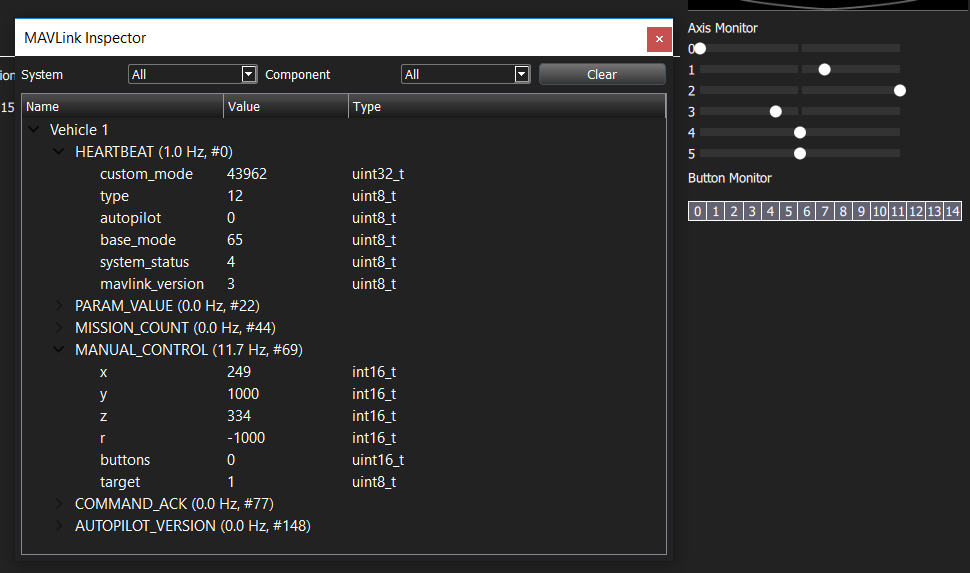
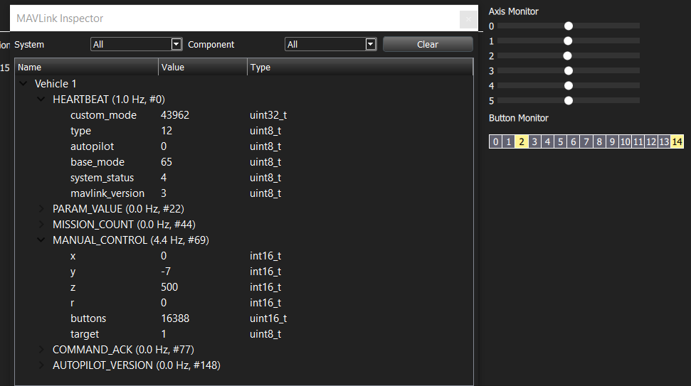
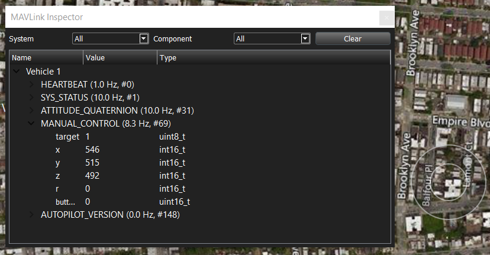

# Establish a MAVLink connection with QGroundControl 

[QGroundControl](http://qgroundcontrol.com/) is an open-source
"ground control station" for uncrewed aerial vehicles. It's an all-in-one center for display of live-streaming inbound UDP video, attractive display of vehicle telemetry, and manual joystick remote control. It communicates with the vehicle controller using the [open MAVLink protocol](https://mavlink.io/). Though it's specialized for autonomous aerial vehicle control, I thought it would be a good option for remote human-piloted teleoperation of a simpler robot. 

I got it working, but had a hard time finding clear documentation or a simple example of how to establish a MAVLink "connection" between a vehicle and [QGroundControl](http://qgroundcontrol.com/) outside of the context of a complicated UAV or UUV autopilot framework. 

The Arduino-compatible sketch here uses some [common MAVLink messages](https://mavlink.io/en/messages/common.html) via the auto-generated C headers (added to this project as a submodule) to negotiate a serial-port connection with QGroundControl. Once connected, the controller will send some simple fake telemetry to QGroundControl and respond to manual control packets from QGC. Manual control assumes that a [supported joystick](https://docs.qgroundcontrol.com/en/SetupView/Joystick.html#supported-joysticks) is connected to the ground control computer and calibrated. I tested this with the Logitech F710.

This sketch is a demonstration and is not necessarily intended to be useful by itself. If you are working with a [quadcopter](http://px4.io/), [boat](https://discuss.ardupilot.org/t/rover-3-0-0-release/8267), [submarine](https://github.com/bluerobotics/ardusub/), or [wheeled rover](https://discuss.ardupilot.org/t/rover-3-0-0-release/8267), using one of the appropriate autopilot software offerings would probably be more appropriate than working with MAVLink messages directly.

If you're trying implement some new functionality using a microcontroller running in parallel with an existing autopilot flight stack, you don't need to negotiate a connection with QGC, and you're probably looking for something more like [MAVLink and Arduino: step by step](https://discuss.ardupilot.org/t/mavlink-and-arduino-step-by-step/25566/22).

My example is targeted toward the use of QGroundControl to control and monitor a well-developed robot or vehicle that is a poor fit for the existing autopilots (like a snake robot or a grappling-hook-launching cable robot): something that already has significant work invested in its custom control hardware and code, and needs MAVLink as an added feature.

## Using This Sketch

I was hoping to implement this on an Arduino Uno, but in its current form, it doesn't fit in memory. It uses about 36k flash and 5.7k for globals. In tests so far, it's running on a [Teensy 3.6](https://www.pjrc.com/store/teensy36.html), where it only consumes a few percent of the available memory. I might try to optimize it to fit on the Uno but it will require careful sharing of resources, and/or tinkering with the internal MAVLink buffer allocations and I don't want that complication in a basic demo. 

Upload this to anything Arduino-compatible (implementing the `Serial` methods, etc). To open the communications link, you need to manually configure (`Q Menu->Comm Links->Add`) and connect to the appropriate serial port in QGroundControl. This will result in a connected "vehicle" and some incoming telemetry.

Connecting, calibrating, and enabling a compatible joystick, like my Logitech F710, will allow QGroundControl to send [`#69 MANUAL_CONTROL`](https://mavlink.io/en/messages/common.html#MANUAL_CONTROL) messages to the target controller. To avoid the need for external hardware for this demonstration, the sketch simply transmits the recieved manual control message back to QGroundControl. The re-transmitted messages can be viewed in the MAVLink Inspector widget:

The fields in the manual control message show the continous joystick values `x`, `y`, `z`, and `r`:

and `buttons` gives one integer value for the entire button bitfield. Here, buttons 2 and 14 are pressed, giving 22+214=16388:

To use the manual control data, you can access the values like `mvl_joy.z` or `mvl_joy.buttons` in the function `MVL_Handle_Manual_Control()`. Note that the joystick axis that's mapped to `throttle` has a different behavior from the others.

If you don't have a physical joystick or gamepad yet, you can turn on the virtual joysticks in the QGC settings to start the streaming and loopback of the `MANUAL_CONTROL` messages: 

Without a real or virtual joystick, QGC won't send any `MANUAL_CONTROL` messages and so you won't see them in MAVLink Inspector.

This sketch demonstrates:
 * Handling QGC's series of start-up queries to negotiate a successful "connection" between the controller and QGroundControl, i.e.
   * Responding to `PARAM_REQUEST_LIST` with a single `PARAM_VALUE` message.
   * Responding to `MISSION_REQUEST_LIST` with a `MISSION_COUNT` message saying there are zero mission items.
   * Responding to a `MAV_CMD_REQUEST_AUTOPILOT_CAPABILITIES` command (in a `COMMAND_LONG` message) with an `AUTOPILOT_VERSION` message. 
 * Handling the `MANUAL_CONTROL` messages that you'll want to use for vehicle/robot teleoperation.
 * Handling and acknowledging arm/disarm commands (which come in as a `COMMAND_LONG` message)
 * Sending some fake telemetry via `SYS_STATUS` and `ATTITUDE_QUATERNION` messages including: 
   * A gentle rocking in pitch and roll in the attitude display.
   * A continuous rotation in the heading display.
   * A battery voltage ramp from 10-16V.

## Caveats

I started with the [connection control flow](https://dev.qgroundcontrol.com/en/communication_flow.html) in the [QGroundControl Developers' Guide](https://dev.qgroundcontrol.com/en/). I dug through several autopilots' source code trying to find the specific MAVLink messages that were sent at each step, but with many layers of object-oriented code across hundreds of files, this was not particularly productive.

Instead, I printed information about every valid MAVLink message that came in and worked out the specific messages I needed through trial and error. I believe that all the message responses in this sketch *are* necessary to establish a "connection" and to get the joystick interface to appear in QGC, but I haven't tested that exhaustively since I got the connection to work.

I also assume that the connection between QGC and the vehicle controller is perfect. With unreliable communications, there may be some re-request messages that would need to be handled that I wouldn't have seen in my testing over a wired link. 

I've tested this on Windows 10 with the [Blue Robotics Fork of QGroundControl (v3.2.4)](https://discuss.bluerobotics.com/t/software-updates-8-may-2018/2617) and the [official version (v 3.3.2)](http://qgroundcontrol.com/downloads/).
